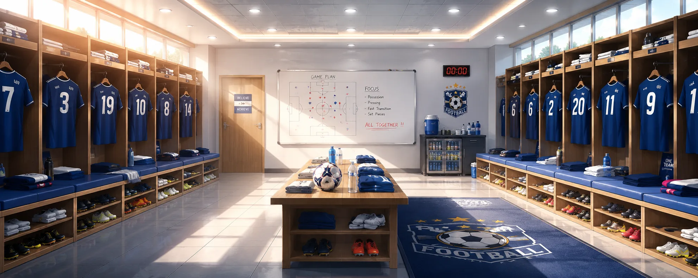
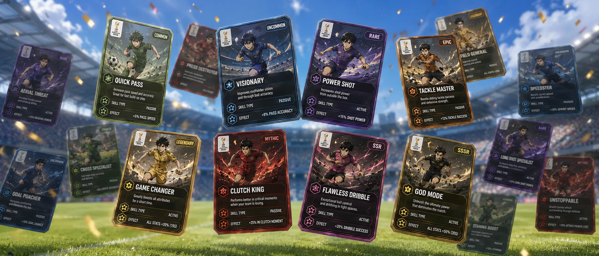

# OddsDraft — Live Fantasy Football on Solana

> **Build your 5-a-side squad. Watch the match live. Earn points in real-time. Collect rare Skill Cards.**

🌐 **Live App:** [oddsdraft.fun](https://oddsdraft.fun)  
📦 **GitHub:** [github.com/sandhywarhol/OddsDraft](https://github.com/sandhywarhol/OddsDraft)  
📬 **Telegram Bot:** [@oddsdraftbot](https://t.me/oddsdraftbot)

---

## What Is OddsDraft?

OddsDraft is a **real-time fantasy football game** built on Solana, powered by live match data from the **TxLINE API** (TxODDS). During FIFA World Cup 2026, players:

1. **Build a 5-a-side lineup** before kickoff — pick GK, DEF, MID, SWG (winger), ATT
2. **Pay the entry fee on-chain** (0.01 SOL via Phantom Wallet)
3. **Watch their points update live** as TxLINE streams real match events — goals, saves, cards, assists
4. **Win SOL prizes** distributed on-chain to the top-ranked managers

What makes OddsDraft unique is the **Skill Card layer**: after every match, players earn RNG-based collectible cards that boost their fantasy scores — and can be combined into rarer versions.

---

## Screenshots

| Homepage | Match Schedule | Lineup Builder |
|----------|----------------|----------------|
|  |  |  |

| Live Match | Leaderboard | Card Collection |
|------------|-------------|-----------------|
|  |  |  |

---

## Core Game Loop

```
Before Kickoff          During Match          After Full Time
─────────────────       ─────────────────     ─────────────────
Pick 5 players    →     TxLINE streams   →    Points locked
Assign Captain          live events            Prize distributed
Set Confidence ⭐       NPC commentary         Skill Card earned
Equip Skill Cards       Score updates          Cards combinable
Pay 0.01 SOL            Telegram alerts        Marketplace (soon)
```

---

## Scoring System

Points are awarded by position — riskier positions earn more for rare feats.

| Event | GK | DEF | MID | SWG | ATT |
|-------|----|-----|-----|-----|-----|
| Goal | +20 | +15 | +12 | +11 | +10 |
| Assist | +6 | +6 | +6 | +6 | +6 |
| Clean Sheet | +5 | +5 | +1 | +1 | — |
| Save | +1 | — | — | — | — |
| Yellow Card | −2 | −2 | −2 | −2 | −2 |
| Red Card | −5 | −5 | −5 | −5 | −5 |

**Captain**: chosen player earns 2× points.  
**Confidence** (⭐1–5): multiplies all points by 1.0×–1.5×. High stars = high risk/reward.  
**Skill Cards**: flat bonuses on top (e.g. "Legendary Striker Card: +5 pts on every goal").

---

## Skill Card System — The Collectible Layer

After every match, players receive a **random Skill Card** from the pack. Cards have 8 rarities:

| Rarity | Color | Drop Rate |
|--------|-------|-----------|
| Common | Grey | 50% |
| Uncommon | Green | 25% |
| Rare | Blue | 12% |
| Epic | Purple | 6.5% |
| Legendary | Orange | 4% |
| Mythic | Red | 1.5% |
| SSR | Pink | 0.7% |
| SSSR | Gold | 0.3% |

**Card Combining**: collect 2 copies of the same card → combine into the next rarity tier.  
**Equip before kickoff**: each player slot gets one card for that match only.  
**Marketplace (upcoming)**: cards will be NFT-backed and tradeable peer-to-peer on Solana.

Cards are position-specific (Goalkeeper / Defender / Midfielder / Winger / Striker) and each carries a different `ModifierType`:

- `goal_bonus` — extra points per goal
- `clean_sheet_bonus` — bonus for a clean sheet
- `goalkeeper_save_bonus` — per-save bonus
- `yellow_card_reduction` — reduces yellow card penalty
- `penalty_save_bonus`, `appearance_bonus`, and more

---

## TxLINE API Integration

OddsDraft uses **6 TxLINE endpoints** across the full match lifecycle:

| Endpoint | Usage |
|----------|-------|
| `POST /auth/guest/start` | Obtain guest JWT for unauthenticated users |
| `POST /api/token/activate` | Activate API token for authenticated sessions |
| `GET /api/fixtures/snapshot` | List all World Cup fixtures; filter live ones client-side |
| `GET /api/scores/snapshot/{fixtureId}` | Full state on page load (historical events, score, game state) |
| `GET /api/scores/updates/{fixtureId}` | SSE stream polled every 4s — drives live score, events, clock, and NPC dialog |
| `GET /api/fixtures/lineups/{fixtureId}` | Official lineups for player-ID resolution and starting-XI points |

### Event Mapping

TxLINE SSE events are parsed via `mapEventToFantasyType()` and translated to OddsDraft event types:

```
goal / penaltyoutcome         →  goal
owngoal                       →  own_goal
yellowcard / redcard          →  yellow_card / red_card
substitution                  →  substitution + sub_appearance
shot (Outcome=Saved)          →  goalkeeper_save (synthesized)
goal + assistPlayerId present →  assist (synthesized)
goal (opponent)               →  goal_conceded (synthesized)
var / corner / kickoff / ...  →  var_review / corner_kick / kick_off / ...
```

The `PlayerStats` cumulative snapshot (goals, yellowCards, redCards, assists, saves per player) serves as a **secondary detection path** when individual SSE events are missing or unconfirmed.

---

## NPC Commentary System

Live matches feature a **JRPG-style NPC dialog system** with animated characters:

- **Referee** (starburst bubble): `KICK OFF`, `CORNER`, `PENALTY`, `HALF TIME`, `FULL TIME`
- **Commentator 1 — Martin** (excited): reacts to goals, red cards, penalty saves
- **Commentator 2 — Alan** (analytical): provides tactical follow-up after Martin
- **Guide NPC**: appears in the Lineup Builder tutorial (8-step interactive walkthrough)

Events trigger 1–7 dialog steps with auto-advance timers. Goal dialogs are prioritized over synthesized `goal_conceded` events so Martin's excited reaction always fires first.

---

## Tech Stack

| Layer | Technology |
|-------|------------|
| Frontend | Next.js 15 (App Router), TypeScript, CSS Modules |
| Blockchain | Solana (devnet/mainnet), Anchor, `@solana/wallet-adapter` |
| Live Data | TxLINE API (TxODDS) via server-side Edge proxy |
| Database | Supabase (PostgreSQL) — lineups, leaderboard, events, prizes |
| Auth | Solana wallet address as identity; guest JWT for TxLINE |
| Notifications | Telegram Bot API (live event alerts, points updates) |
| Deployment | Vercel (Edge Functions for TxLINE proxy) |
| Payments | Native SOL transfers via `@solana/web3.js` |

---

## Architecture

```
Browser                    Vercel Edge                  External
──────────────────────     ────────────────────         ────────────────
Live Page                  /api/txline/[...path]   →    TxLINE SSE
  poll every 4s      →     (token injection,            (txline.txodds.com)
  mergeEvents()            CORS bypass)
  convertTxLineUpdates()
  Priority trigger →       /api/cron/match-events  →    Supabase
  NPC dialog               (dedup, scoring,             Telegram Bot
                           notifications)
  Fantasy Engine     →     /api/scores/wc2026      →    Supabase
  Points + Leaderboard     (lineup resolution,          (prize tables)
                           prize calculation)
```

---

## Running Locally

```bash
git clone https://github.com/sandhywarhol/OddsDraft.git
cd OddsDraft
npm install
```

Create `.env.local`:
```env
NEXT_PUBLIC_TXODDS_API_TOKEN=your_txodds_token
NEXT_PUBLIC_SUPABASE_URL=your_supabase_url
NEXT_PUBLIC_SUPABASE_ANON_KEY=your_supabase_anon_key
NEXT_PUBLIC_SOLANA_NETWORK=devnet
TELEGRAM_BOT_TOKEN=your_telegram_token
```

```bash
npm run dev
# Open http://localhost:3000
```

To experience the full flow without a wallet, click **"Demo Mode"** on any match page.

---

## Submission — TxODDS Consumer & Fan Experiences Hackathon

### Application Access
🌐 [https://oddsdraft.fun](https://oddsdraft.fun)

- No login required — connect any Solana wallet (Phantom recommended) or use **Demo Mode**
- Replay the full lineup tutorial: go to **Match Schedule → Replay Tutorial**
- Watch a live/demo match at any time from the schedule page

### Technical Highlights
- **Real-time Fantasy Engine**: TxLINE SSE events mapped to per-position scoring in < 1 second
- **Dual detection path**: individual events (SSE) + `PlayerStats` cumulative snapshot ensures no goal is ever missed even if the SSE event is unconfirmed
- **Skill Card RNG**: 8-tier collectible system with deterministic combining logic — foundation for a tradeable NFT marketplace
- **On-chain prize distribution**: entry fees and prizes flow through Solana, fully transparent
- **Edge proxy architecture**: TxLINE tokens never exposed to browser; all requests route through Vercel Edge Functions

### TxLINE Endpoints Used
1. `POST /auth/guest/start`
2. `POST /api/token/activate`
3. `GET /api/fixtures/snapshot`
4. `GET /api/scores/snapshot/{fixtureId}`
5. `GET /api/scores/updates/{fixtureId}` ← primary live event source
6. `GET /api/fixtures/lineups/{fixtureId}`

### Feedback on TxLINE API

**What we loved:**
- The SSE stream is low-latency and reliable — events arrive within seconds of real-world actions
- The `PlayerStats` cumulative snapshot is a brilliant safety net; it caught goals our event parser initially missed
- The fixture snapshot endpoint made bootstrapping historical match state on page-load trivial
- `Confirmed` flag on events is extremely thoughtful — it let us filter out VAR-reversed goals cleanly

**Where we hit friction:**
- `PlayerName` is often empty on goal/card events — only `PlayerId` is populated. We had to build a full `buildPlayerIdMap()` resolution layer using the lineups endpoint to match TxLINE player IDs to our internal player database
- `GameState` field is sometimes `"scheduled"` even when the match is live; we worked around this by reading `Clock.Running` as the ground-truth signal
- The `Participant` field is frequently absent on goal events — team determination required fallback logic (player's known team from our DB, then coin-flip default)
- Documentation for the SSE stream format took some reverse-engineering; a worked example showing a full goal event payload with all fields would have saved us hours
- Rate limiting behavior on the updates endpoint isn't documented — we discovered the safe polling interval empirically

---

## License

MIT © 2026 OddsDraft Team
